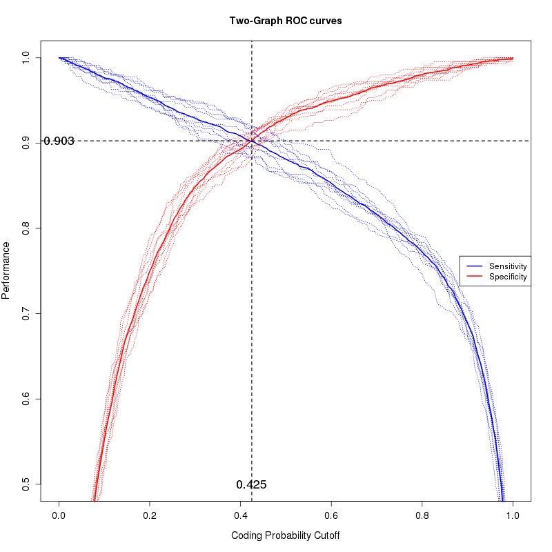
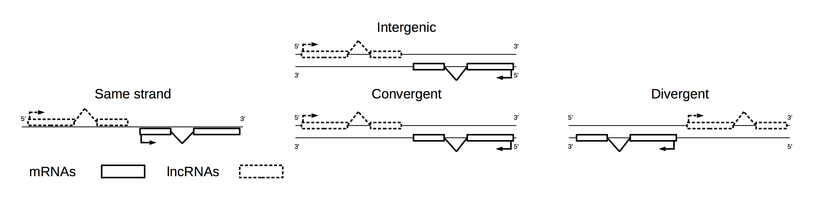
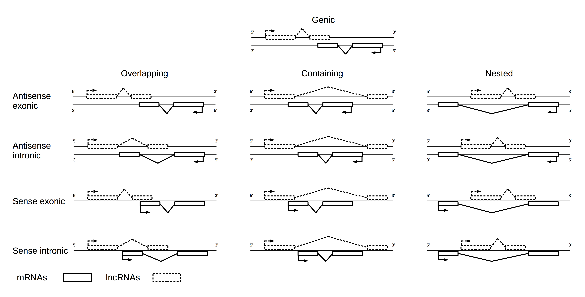

# FEELnc :
## FlExible Extraction of Long non-coding RNAs


This document is intended to give a technical description of the FEELnc pipeline in order to annotate long non-coding RNAs (lncRNAs)  based on reconstructed transcripts from RNA-seq data (either with or without a reference genome).
For a more general overview of lncRNAs annotation using RNASeq and FEELnc specific advantages, you could point to [the FEELnc paper](http://nar.oxfordjournals.org/content/early/2017/01/03/nar.gkw1306.full).

--------

 - [Introduction](https://github.com/tderrien/FEELnc#introduction)
 - [Input files](https://github.com/tderrien/FEELnc#input-files)
 - [Installation](https://github.com/tderrien/FEELnc#installation-and-requirements) 
    - [Install via Conda]( https://github.com/tderrien/FEELnc#install-via-conda)
 - [Test Install](https://github.com/tderrien/FEELnc#test-with-toy-example)   
 - [FEELnc module](https://github.com/tderrien/FEELnc#launch-the-3-step-pipeline)
   -  [filter](https://github.com/tderrien/FEELnc#1--feelnc_filterpl)
   -  [coding_potential](https://github.com/tderrien/FEELnc#2--feelnc_codpotpl)
   -  [classifier](https://github.com/tderrien/FEELnc#3--feelnc_classifierpl)
 - [FEELnc Versions](https://github.com/tderrien/FEELnc#versions)
 - [Citation](https://github.com/tderrien/FEELnc#citation)	
 - [Questions/Comments/bug](https://github.com/tderrien/FEELnc#comment---questions---bugs)


## Introduction

Currently, FEELnc is composed of 3 modules.

	* FEELnc_filter.pl	: Extract, filter candidate transcripts.
	* FEELnc_codpot.pl	: Compute the coding potential of candidate transcripts.
	* FEELnc_classifier.pl: Classify lncRNAs based on their genomic localization wrt others transcripts.

While the first and third modules require a reference genome, the  2nd module (which computes the coding potential) does not require any reference genome and could be run on de novo assembled transcripts in fasta format.


To get help on each module, you can type :

	FEELnc_filter.pl --help
	# Or
	FEELnc_filter.pl --man


## Input files

The formats used to describe genes, transcripts, exon is **.GTF** and **.FASTA** for genome file.

Basically, FEELnc users should have the following minimal input files:

	- Infile.GTF          (-i,--infile)   : input GTF file (e.g cufflinks/stringtie transcripts.GTF) or FASTA (Tritnity, KisSplice)
	- ref_annotation.GTF  (-a,--mRNAfile) : GTF annotation file or FASTA file * 
	- ref_genome.FASTA    (-g,--genome)   : genome FASTA file or directory with individual chrom FASTA files


\* *Note: It is recommended to only extract protein_coding transcripts (mRNAs) from the reference annotation file (ref_annotation.GTF) when this information is available, either manually or better by using the option :*
**--biotype transcript_biotype=protein_coding**.


-------------------------
## Installation and requirements


### Requirements

The following software and libraries must be installed on your machine:

- [Perl5+](https://www.perl.org/) : tested with version 5.18.2
 * [Bioperl](http://www.bioperl.org/wiki/Main_Page)  : tested with version BioPerl-1.6.924 (partial tests with BioPerl >=1.7);
 * [Parallel::ForkManager](http://search.cpan.org/perldoc/Parallel::ForkManager) : tested with version 1.07.

- R [Rscript](http://cran.r-project.org): tested with version 3.1.0.
 * [ROCR](https://rocr.bioinf.mpi-sb.mpg.de/) test with version 1.0-5;
 * [randomForest](http://cran.r-project.org/web/packages/randomForest/index.html) tested with version 4.6-10.
 * These R librairies should be installed automatically when running FEELnc. In case it does not work, please type in a R session:
	install.packages('ROCR')
	install.packages('randomForest')

- [KmerInShort](https://github.com/rizkg/KmerInShort) developped by Guillaume Rizk:
 * Linux and MAC executables in FEELnc bin directory;
 * If any trouble using supplied executables, please download and compile from sources.
 
- [fasta_ushuffle](https://github.com/agordon/fasta_ushuffle) software:
 * uShuffle: A useful tool for shuffling biological sequences while preserving the k-let counts;
   M. Jiang, J. Anderson, J. Gillespie and M. Mayne; BMC Bioinformatics 2008, [9:192 doi:10.1186/1471-2105-9-192](http://bmcbioinformatics.biomedcentral.com/articles/10.1186/1471-2105-9-192).
 * required only if  you want to use the **shuffle** mode
 * Linux and MAC executables in FEELnc bin directory;
 * If any trouble using supplied executables, please download and compile from sources.
 
 
### Installation

Clone the FEELnc git:

	git clone https://github.com/tderrien/FEELnc.git

Go to FEELnc directory

	cd FEELnc

Export PERL5LIB and FEELNCPATH variables

	export FEELNCPATH=${PWD}
	export PERL5LIB=$PERL5LIB:${FEELNCPATH}/lib/ #order is important to avoid &Bio::DB::IndexedBase::_strip_crnl error with bioperl >=v1.7

	export PATH=$PATH:${FEELNCPATH}/scripts/
	export PATH=$PATH:${FEELNCPATH}/utils/

	# for LINUX
	#----------
	export PATH=$PATH:${FEELNCPATH}/bin/LINUX/
	# or
	cp ${FEELNCPATH}/bin/LINUX/ ~/bin/

	# for MAC
	# --------
	export PATH=$PATH:${FEELNCPATH}/bin/MAC/
	# or
	cp ${FEELNCPATH}/bin/MAC/ ~/bin/


### Install via [Conda](https://anaconda.org/bioconda/feelnc):

Create a new environment containing FEELnc (and its dependencies):

	conda create -p ~/feelnc_install_dir feelnc 

To activate it:

	source activate ~/feelnc_install_dir 

To deactivate it:

	source deactivate

(thanks to [Genouest Bionformatics](https://www.genouest.org)

### Test with toy example:

	cd test/

	# Filter
	FEELnc_filter.pl -i transcript_chr38.gtf -a annotation_chr38.gtf \
    -b transcript_biotype=protein_coding > candidate_lncRNA.gtf

	# Coding_Potential
	FEELnc_codpot.pl -i candidate_lncRNA.gtf -a annotation_chr38.gtf -b transcript_biotype=protein_coding -g genome_chr38.fa --mode=shuffle

	# Classifier
	FEELnc_classifier.pl -i feelnc_codpot_out/candidate_lncRNA.gtf.lncRNA.gtf -a annotation_chr38.gtf > candidate_lncRNA_classes.txt


### Results on the toy exemple:
The *results* directory in *test* contains the results files on the toy exemple. For more details, see the specific parts on [each modules](https://github.com/tderrien/FEELnc#launch-the-3-step-pipeline).


### Note:
A bash script *utils/FEELnc_pipeline.sh* is provided to run the three steps in one command line. As an example, this script is made to be used on a .GTF file without lncRNA file. It filters candidates only on mRNA annotation, keeps antisense monoexonic transcripts and uses the shuffle mode. Feel free to modify it at your convenience. To run on the toy example:

	cd test/

	FEELnc_pipeline.sh --candidate=transcript_chr38.gtf --reference=annotation_chr38.gtf \
	                   --genome=genome_chr38.fa --outname=testOnToyExample --outdir=test_on_toy_example


-------------------------
## Launch the 3-step pipeline

### 1- FEELnc_filter.pl

The first step of the pipeline (FEELnc_filter) consists in filtering out unwanted/spurious transcripts and/or transcripts overlapping (in sense) exons of the reference annotation
and especially protein_coding exons as they more probably correspond to new mRNA isoforms (see -b,--biotype option).

	# Usage:
    FEELnc_filter.pl -i infile.gtf -a annotation_mRNA.gtf > candidate_lncRNA.gtf


If your reference annotation ("*ref_annotation.GTF*") contains transcript_biotype information (e.g protein_coding, pseudogene, miRNA...), you can subselect a specific transcript biotype to make the overlap with.

    FEELnc_filter.pl -i infile.gtf \
	-a ref_annotation.GTF \
	-b transcript_biotype=protein_coding \
	> candidate_lncRNA.gtf

This option is highly recommended if you don't want to remove transcripts
overlapping with other transcripts than mRNAs (e.g lincRNA, miRNA, pseudogene...).
For stranded RNASeq protocol, it is also possible  to include monoexonic lncRNAs that are antisense to mRNAs e.g

	FEELnc_filter.pl -i infile.gtf \
	-a ref_annotation.GTF \
	-b transcript_biotype=protein_coding \
	--monoex=-1
	> candidate_lncRNA.gtf


**- FULL OPTIONS (FEELnc_filter.pl --help) :**
```
  * General:
      --help                Print this help
      --man                 Open man page
      --verbosity           Level of verbosity

  * Mandatory arguments:
      -i,--infile=file.gtf          Specify the GTF file to be filtered (such as a cufflinks transcripts/merged .GTF file)
      -a,--mRNAfile=file.gtf        Specify the annotation GTF file to be filtered on based on sense exon overlap (file of protein coding annotation or whole reference annotation 'ref_annotation.GTF')

  * Filtering arguments:
      -s,--size=200                 Keep transcript with a minimal size (default 200)
      -b,--biotype                  Only consider transcript(s) from the reference annotation having this(these) biotype(s) (e.g : -b transcript_biotype=protein_coding,pseudogene) [default undef i.e all transcripts]
      -l,--linconly                 Keep only long intergenic/interveaning ncRNAs [default FALSE].
      --monoex=-1|0|1               Keep monoexonic transcript(s): mode to be selected from : -1 keep monoexonic antisense (for RNASeq stranded protocol), 1 keep all monoexonic, 0 remove all monoexonic   [default 0]
      --biex=25                     Discard biexonic transcripts having one exon size lower to this value (default 25)

  * Overlapping specification:
      -f,--minfrac_over=0           minimal fraction out of the candidate lncRNA size to be considered for overlap [default 0 i.e 1nt]
      -p,--proc=4                   number of thread for computing overlap [default 4]

  * Log output:
      -o,--outlog=file.log          Specify the log file of output which [default infile.log]

```


### 2- FEELnc_codpot.pl

The main step of the pipeline (FEELnc_codpot) aims at computing the CPS i.e the coding potential score (between [0-1]) foreach of the candidate transcripts in the candidate_lncRNA.gtf file.

**- INPUT :**

It makes use of the intrinsic properties of input sequences (ORF coverage and mRNA sizes, k-mer frequencies...) based on 2 training files:


	- known_mRNA.gtf (or .fa)   : a set of known protein_coding transcripts
	- known_lncRNA.gtf  (or .fa): a set of known lncRNA transcripts

If you have a set of known lncRNAs, you could run the module like:

	FEELnc_codpot.pl -i candidate_lncRNA.gtf -a known_mRNA.gtf -l known_lncRNA.gtf

In the absence of species-specific lncRNAs set, machine-learning strategies require to
simulate non-coding RNA sequences to train the model. We developed 2 approaches:

1/ A first approach involves that lncRNAs derived from "debris" of protein-coding
genes (Duret *et al.* 2006). For this strategy that we called **shuffle**, the set of mRNAs are taken and shuffled while preserving 7-mer frequencies using Ushuffle.
If you want to use the **shuffle** mode, please check that the **fasta_ushuffle** binary is in your PATH

    FEELnc_codpot.pl -i candidate_lncRNA.gtf -a known_mRNA.gtf -g ref_genome.FA --mode=shuffle
    or
    FEELnc_codpot.pl -i candidate_lncRNA.fa -a known_mRNA.fa --mode=shuffle


2/ Another more naive approach called **intergenic** consists in extracting random
sequences from the genome of interest to model species-specific noncoding sequences.
In this case, the reference genome file is required (ref_genome.FA) and the mode of
the lncRNA sequences simulation have to been set to **intergenic**.

    FEELnc_codpot.pl -i candidate_lncRNA.gtf -a known_mRNA.gtf -g ref_genome.FA --mode=intergenic

For more details and a comparaison between these two lncRNA simulations, please see the [FEELnc publication](http://nar.oxfordjournals.org/content/early/2017/01/03/nar.gkw1306.full).

As in the previous module, if your reference annotation file  ("*ref_annotation.GTF*") contains additionnal fields such **transcript_biotype** and/or **transcript_status** in the [GENCODE annotation](http://www.gencodegenes.org/gencodeformat.html) or [ENSEMBL](http://www.ensembl.org), you can extract them manually or by using the **-b option** (as  to get the best training set of known mRNAs.

    FEELnc_codpot.pl -i candidate_lncRNA.gtf -a ref_annotation.GTF \
    -g ref_genome.FA \
    -b transcript_biotype=protein_coding -b transcript_status=KNOWN \
    --mode=intergenic


To calculate the CPS cutoff separating coding (mRNAs) versus long non-coding RNAs (lncRNAs),
FEELnc_codpot uses a R script that will make a 10 fold cross-validation on the input training files and finally, extracts the CPS that maximizes sensitivity (Sn) and Specificity (Sp) (thanks to the ROCR library)


**- OUTPUT :**

If your input file is called **INPUT**, this second module will create these output files:

	 - {INPUT}_RF_learningData.txt: FEELnc metrics scores (ORF coverage and mRNA sizes, k-mer frequencies and labels) for the training files.
	 - {INPUT}_RF_statsLearn_CrossValidation.txt: statistics for n cross validation on the training files.
	 - {INPUT}_RF_TGROC.png: TwoGraph ROC curve plot to select the best coding potential cutoff.
	 - {INPUT}_RF.txt: FEELnc metrics scores (ORF coverage and mRNA sizes, k-mer frequencies and labels) for the testing file.
	 - {INPUT}_RF_varImpPlot.png: Dotchart plot of variable importance as measured by a Random Forest.

	 - {INPUT}.lncRNA.gtf || {INPUT}.lncRNA.fa: a .GTF/.FA file of the transcripts below the CPS (i.e the final set of lncRNAs).
	 - {INPUT}.mRNA.gtf || {INPUT}.mRNA.fa: a .GTF/.FA file of the transcripts above the coding potential cutoff (i.e the final set of mRNAs).
	 - [Possibly] {INPUT}.noORF.gtf || {INPUT}.noORF.fa: a .GTF/.FA file of the transcripts without any ORF found by FEELnc using the specified --testorftype option (see FEELnc_codpot.pl options description for more details). Transcripts contained in this file most probably correspond to lncRNAs.

An example of an {INPUT}_RF_TGROC.png graphic obtained using automatic threshold, i.e. sensibility equal to specificity on 10-fold cross-validation:


**- FULL OPTIONS (FEELnc_codpot.pl --help) :**

```

Usage:
    FEELnc_codpot.pl -i transcripts.GTF -a known_mRNA.GTF -g genome.FA -l
    known_lnc.GTF [options...]

Options:
  General:
      --help                Print this help
      --man                 Open man page
      --verbosity           Level of verbosity

  Mandatory arguments:
      -i,--infile=file.gtf/.fasta           Specify the .GTF or .FASTA file  (such as a cufflinks transcripts/merged .GTF or .FASTA file)
      -a,--mRNAfile=file.gtf/.fasta         Specify the annotation .GTF or .FASTA file  (file of protein coding transcripts .GTF or .FASTA file)

  Optional arguments:
      -g,--genome=genome.fa                 Genome file or directory with chr files (mandatory if input is .GTF) [ default undef ]
      -l,--lncRNAfile=file.gtf/.fasta       Specify a known set of lncRNA for training .GTF or .FASTA  [ default undef ]
      -b,--biotype                          Only consider transcripts having this(these) biotype(s) from the reference annotation (e.g : -b transcript_biotype=protein_coding,pseudogene) [default undef i.e all transcripts]
      -n,--numtx=undef                      Number of transcripts required for the training and for all transcripts in the annotation use undef [ default undef ]
      -r,--rfcut=[0-1]                      Random forest voting cutoff [ default undef i.e will compute best cutoff ]
      --spethres=undef                      Two specificity threshold based on the 10-fold cross-validation, first one for mRNA and the second for lncRNA, need to be in ]0,1[ on separated by a ','
      -k,--kmer="1,2,3,6,9,12"                     Kmer size list with sizes separated by ',' as string [ default "3,6,9" ], the maximum value for one size is '15'
      -o,--outname="./"                     Output filename [ default infile_name ]
      --outdir="./"                         Output directory [ default current directory ]
      -m,--mode                             The mode of the lncRNA sequences simulation if no lncRNA sequences have been provided. The mode can be:
                                                    'shuffle'   : make a permutation of mRNA sequences while preserving the 7mer count. Can be done on either FASTA and GTF input file;
                                                    'intergenic': extract intergenic sequences. Can be done *only* on GTF input file.
      -s,--sizeinter=0.75                   Ratio between mRNA sequence and non-coding intergenic extracted region sizes [default 0.75 ]
      --learnorftype=3                      Integer [0,1,2,3,4] to specify the type of longest ORF computation [ default: 1 ] for learning data set. If the CDS is annotated in the .GTF, then the CDS is considered as the longest ORF, whatever the --orftype value.
                                                    '0': ORF with start and stop codon;
                                                    '1': same as '0' and ORF with only a start codon, take the longest;
                                                    '2': same as '0' and ORF with only a stop codon,  take the longest;
                                                    '3': same as '0' and ORF with a start or a stop,  take the longest (see '1' and '2');
                                                    '4': same as '3' but if no ORF is found, take the input sequence as ORF.
      --testorftype=3                       Integer [0,1,2,3,4] to specify the type of longest ORF calculate [ default: 1 ] for test data set. See --learnortype description for more informations.
      --ntree                               Number of trees used in random forest [ default 500 ]

  Debug arguments:
      --keeptmp                           To keep the temporary files in a 'tmp' directory the outdir, by default don't keep it (0 value). Any other value than 0 will keep the temporary files
      -v,--verbosity=0                         Which level of information that need to be print [ default 0 ]
      --seed=1234                           Used to fixe the seed value for the randomisation of mRNA sequences by Ushuffle, the extraction of intergenic DNA region to get lncRNA like sequences and for the random forest [ default 1234 ]

```

### 3- FEELnc_classifier.pl


The last step of the pipeline consists in classifying new lncRNAs w.r.t to the localisation and the direction of transcription of proximal RNA transcripts because classifying lncRNAs with mRNAs (or other ncRNAs) could help to predict functions for lncRNAs.

**- Types of interactions:**

For all newly identified lncRNAs transcripts, a sliding window strategy is used to check for possible overlap with nearest transcripts from the reference annotation.
A first level of classification disciminates 2 **TYPES** of interactions:

* `GENIC`  : when the lncRNA gene overlaps an RNA gene from the reference annotation file.
* `INTERGENIC` (lincRNA):  otherwise

Then, **subtypes** and **locations** are defined according the orientation of the interactions and the localisation of the interactions (See OUTPUT and last figure for more details):

* `GENIC` type :
 * `overlapping` subtype	: the lncRNA partially overlaps the RNA partner transcript
   * then `exonic` or `intronic` locations.
 * `containing` subtype	: the lncRNA contains the RNA partner transcript
   * then `exonic` or `intronic` locations.
 * `nested` subtype	: the lncRNA is contained in the RNA partner transcript
   * then `exonic` or `intronic` locations.

* `INTERGENIC` type :
 * `divergent` subtype	: the lncRNA is transcribed in head to head orientation with RNA_partner
   * then `upstream` or `downstream` locations.
 * `convergent` subtype	: the lncRNA is oriented in tail to tail with orientation with RNA_partner
   * then `upstream` or `downstream` locations.
 * `same_strand`subtype	: the lncRNA is transcribed in the same orientation orientation with RNA_partner
   * then `upstream` or `downstream` locations.


Foreach lncRNA interaction, a best lncRNA:RNA_partner interaction is identified in the output file with a value == 1 in the first column **isBest** (0 otherwise). This flag is defined according to the following rule:

 - for `INTERGNIC` : the best RNA partner is the **closest** to the lincRNA
 - for `GENIC`	: the best RNA partner is by rule of priority **exonic** (then the fraction of exonic overlap) > **intronic** > **containing**.


**- USAGE :**

```
	FEELnc_classifier.pl -i lncRNA.gtf -a  ref_annotation.GTF > lncRNA_classes.txt
```


**- OUTPUT :**

If your input file is called **INPUT**, the classifier will create these output files:

	 - {INPUT}_feelncclassifier.log: general statistics on the number of interactions
	 - {INPUT}_classes.txt: tabulated-format file with all the interactions


Output examples:

```
cat {INPUT}_feelncclassifier.log
#FEELnc Classification
#lncRNA file :  lncrna : lncRNA_34.gtf
#mRNA file : 34.gtf
#Minimal window size : 1000
#Maximal window size : 1000
#Number of lncRNA : 462
#Number of mRNA : 374
#Number of interaction : 180
#Number of lncRNA without interaction : 369
#List of lncRNA without interaction : TCONS_00162422 TCONS_00163593 TCONS_00160948 TCONS_00162636 TCONS_00161917 TCONS_00161884 TCONS_00162654 TCONS_00164153 TCONS_00162630 TCONS_00161117 TCONS_00163030 TCONS_00162985 TCONS_00162306 TCONS_00162438
```

```
cat {INPUT}_classes.txt
isBest  lncRNA_gene  lncRNA_transcript  partnerRNA_gene     partnerRNA_transcript  direction  type        distance  subtype      location
1       XLOC_090743  TCONS_00232056     ENSCAFG00000013346  ENSCAFT00000021186     antisense  intergenic  377       divergent    upstream
1       XLOC_090720  TCONS_00231943     ENSCAFG00000026373  ENSCAFT00000040656     sense      intergenic  66670     same_strand  upstream
1       XLOC_090678  TCONS_00231794     ENSCAFG00000010781  ENSCAFT00000017151     antisense  genic       0         nested       intronic
0       XLOC_090678  TCONS_00231794     ENSCAFG00000010794  ENSCAFT00000017171     sense      intergenic  8293      same_strand  upstream
0       XLOC_090678  TCONS_00231794     ENSCAFG00000010781  ENSCAFT00000017154     antisense  genic       0         overlapping  intronic
1       XLOC_090878  TCONS_00232599     ENSCAFG00000009675  ENSCAFT00000015370     sense      intergenic  19181     same_strand  upstream
1       XLOC_090974  TCONS_00232971     ENSCAFG00000010842  ENSCAFT00000017240     sense      intergenic  85066     same_strand  downstream
1       XLOC_090620  TCONS_00231531     ENSCAFG00000009999  ENSCAFT00000015918     antisense  genic       0         overlapping  exonic
0       XLOC_090620  TCONS_00231531     ENSCAFG00000009970  ENSCAFT00000015870     antisense  intergenic  516       divergent    upstream

```

Here is showed 9 interactions concerning 6 lncRNAs where one lncRNA (TCONS_00231794) has 3 interactions with a window size of 1,000 nt.
(The best interactions are labelled with a 1 in isBest column)

**- Illustration of the classification :**




\* **Note1**: At the moment, the interactions are computed with the reference file (-a option).
Therefore, the possibly newly identified mRNAs in the previous step are not included by default (but you could include them by merging/pasting it with you reference annotation).

\* **Note2**:  you may see a warning message like this:

	lncRNA_ID and ENSXXXX are overlapping in the same strand
Depending on your filtering options, this may correspond to a non-protein-coding transcript (pseudogene, miRNA) which overlaps the lncRNA

**- FULL OPTIONS (FEELnc_classifier.pl --help) :**

```
    General:
      -b,--biotype          Print the biotype of each transcripts in the output
      -l,--log              Specify the name for the log file
      --help                Print this help
      --man                 Open man page
      --verbosity           Level of verbosity

    Mandatory arguments:
      -i,--lncrna=file.(gtf/gff) Specify the lncRNA GTF/GFF file
      -a,--mrna=file.(gtf/gff)    Specify the annotation GTF/GFF file (file of protein coding annotaion)

    Filtering arguments:
      -w,--window=200               Size of the window around the lncRNA to compute interactins/classification [default 10000]
      -m,--maxwindow=10000          Maximal size of the window during the expansion process [default 100000]
```

## Warnings

 - In the installation (and/or) the classifier step, you may see a warning like
```
Can't call method "close" on an undefined value Bio/DB/SeqFeature/Store/berkeleydb.pm
```

## Authors

 - Valentin Wucher
 - Fabrice Legeai
 - Thomas Derrien

## Versions

Go to [FEELnc releases](https://github.com/tderrien/FEELnc/releases)

## Citation

[Wucher, V. et al. FEELnc: a tool for long non-coding RNA annotation and its application to the dog transcriptome. Nucleic Acids Res (2017). doi:10.1093/nar/gkw1306](http://nar.oxfordjournals.org/content/early/2017/01/03/nar.gkw1306.full)


## Comment - Questions - Bugs

Use the [Github Issues link](https://github.com/tderrien/FEELnc/issues).


## Acknowledgments

To the users of FEELnc and to GenOuest Bioinformatics core facility.
